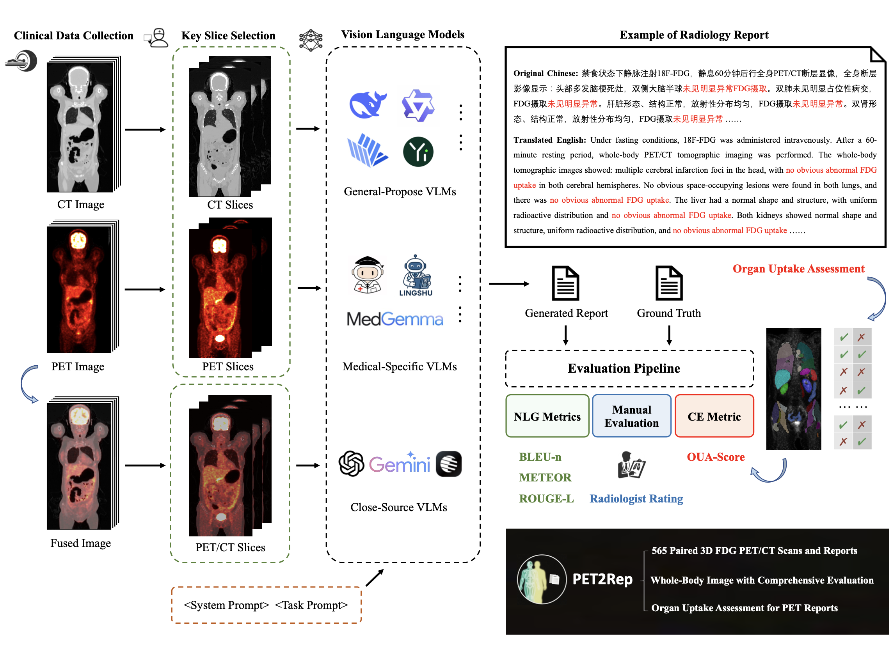
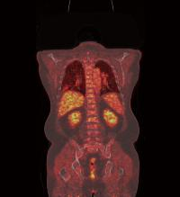
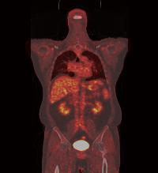
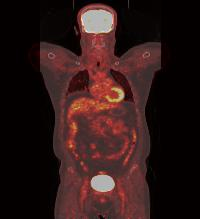

# PET2Rep
[**📖 arXiv**](https://arxiv.org/abs/2508.04062) | [**🎈 GitHub**](https://github.com/YichiZhang98/PET2Rep) 

This repository is the official implementation of **PET2Rep: Towards Vision-Language Model-Drived Automated Radiology Report Generation for Positron Emission Tomography**.



## Overview
PET2Rep is the first benchmark for evaluating VLMs in PET radiology report generation. It includes 565 whole-body PET/CT image-report pairs covering dozens of organs with metabolic information, which is essential for reflecting the real-world clinical comprehensiveness of PET imaging in oncologic diagnostics.


## Quick Start
To get started, please clone this repository and follow the instructions below to set up your environment and run the demo.

```bash
git clone https://github.com/YichiZhang98/PET2Rep.git
cd PET2Rep
```

Create and activate a virtual environment. 
```bash
conda create -n pet2rep python=3.10 -y
conda activate pet2rep
```

Here we provide an inference example for Qwen2.5-VL, other VLMs were also performed obeying the instruction of their technical reports. You can solve the environment by 
```bash
pip install -e requirements.txt
```
Alternatively, you can also refer to the Hugging Face page of [Qwen2.5-VL](https://huggingface.co/Qwen/Qwen2.5-VL-32B-Instruct).
```bash
pip install git+https://github.com/huggingface/transformers accelerate
pip install qwen-vl-utils[decord]==0.0.8
```

Run the inference script of Qwen2.5-VL, `inference_qwen25vl.py`. 
And the content in the prompt file `text_prompt/prompt_qwen25vl.jsonl` will be fed into the model for inference.
```bash
python inference_qwen25vl.py
```
The results will be saved to the output file `results/result_qwen25vl.jsonl`.


## Report Generation
We provide PET/CT slices as image input, and a typical nuclear medical report as an example for the VLM to genrate a structural report. The following is an **demo case** of the task:

**Images:**






**Text (Chinese):**
```
你是一位经验丰富的核医学科医师，擅长结合PET/CT图像和临床信息撰写诊断报告。
请你根据提供的全身FDG-PET/CT图像，按照结构化格式生成核医学报告。基于模版修改，需详细描述异常18F-FDG摄取病灶的位置、大小和程度（增高/降低/无异常）等。同时给出PET异常区域异常区域的CT所见。以下是参考的结构化报告输出模板，请根据患者PET/CT影像调整[]和【】中结论。\n参考结构化报告示例如下，严格按照以下格式输出：\n禁食状态下静脉注射18F-FDG，静息60分钟后行全身PET断层显像，全身断层影像显示：脑形态、结构[正常]，双侧大脑皮质放射性分布【均匀、对称】，FDG【摄取未见明显异常】。各脑室、脑沟、脑裂、脑池[形态增宽，两侧脑室对称，中线结构无偏移]。\n双侧眼球形态和轮廓[无异常]，FDG【无异常摄取】。右侧上颌窦黏膜[稍增厚伴部分钙化]，FDG【摄取未见异常】。鼻咽壁[未见增厚，两侧腭扁桃体对称]，FDG【呈生理性摄取】。喉咽[形态、结构未见异常]。双侧腮腺、颌下腺[形态、密度正常]，FDG【生理性摄取】。甲状腺[形态、大小正常，密度均匀]，FDG【摄取未见异常】。双侧颈深间隙、颌下[见数枚小淋巴结显示]，部分淋巴结FDG【摄取增高】。\n两肺[透亮度增加，两肺上叶胸膜下见囊状透亮影。右肺中叶体积缩小，右肺中叶肺门旁见片状密度增高影]，FDG【摄取增高】。心影[未见异常。部分动脉管壁钙化（包括冠状动脉）]。\n食管[未见扩张，管壁未见明显增厚或肿块]，FDG【摄取未见增高】。肝缘[欠光整，肝裂未见明显增宽，CT平扫肝右叶下段见巨大稍低密度肿块影，边界欠清]，FDG【摄取增高】。肝左叶[见稍低密度结节，边界尚清晰]，FDG【摄取较本底摄取减低】。肝右叶[膈顶区另见结节状致密影]。门静脉主干及左右支[明显增粗，密度增高]，FDG【摄取增高】。门腔间隙、肝胃间隙、腹膜后[见淋巴结显示]，FDG【摄取轻度增高】。\n胆囊[稍饱满，胆囊壁未见增厚]，局部FDG【摄取未见异常】。胰腺[形态正常，胰体部见小结节状钙化灶，主胰管未见增宽]，FDG【摄取未见明显异常】。脾脏[形态、大小密度未见异常]，FDG【摄取未见异常】。双侧泌尿系统【见对比剂残留影】；左肾[体积缩小，左肾见多枚囊状低密度影及稍高密度小结节，边界清]，FDG【摄取缺失】；右肾[上极见一脂肪密度结节]，FDG【摄取未见异常】。双侧肾盂肾盏及输尿管[未见增宽]。双侧肾上腺显影[未见明显异常]，FDG【摄取未见异常】。\n胃[充盈尚可，胃壁未见明显增厚]，部分胃壁FDG【摄取增高】。肠道[充盈欠佳，肠壁未见明显增厚或肿块]，FDG【呈生理性摄取】。前列腺[稍增大，实质内见数枚钙化灶]，FDG【摄取未见异常增高】。膀胱[充盈欠佳]，内【见对比剂残留影】。\n骨质密度[不均匀减低]，脊柱[部分椎体边缘骨质增生]。FDG【摄取未见异常】。
```
**Text (English):**
```
You are an experienced nuclear medicine physician, skilled in combining PET/CT images with clinical information to prepare diagnostic reports. Please generate a nuclear medicine report in a structured format based on the provided whole-body FDG-PET/CT images. Based on the template modifications, please provide a detailed description of the location, size, and degree (increased/decreased/abnormal) of abnormal 18F-FDG uptake. Also provide the CT findings of the abnormal PET and CT areas. Below is a sample structured report output template. Please adjust the conclusions in [] and 【】 based on the patient's PET/CT images. The following is a sample structured report output, strictly following the following format: A whole-body PET scan is performed after 60 minutes of rest after intravenous administration of 18F-FDG in the fasting state. The whole-body PET scan shows: [normal] brain morphology and structure, 【uniform and symmetrical】 radioactivity distribution in the bilateral cerebral cortex, and 【no significant abnormalities】 in FDG uptake. The ventricles, sulci, fissures, and cisterns show [widening of the morphology, symmetry of the ventricles, and no deviation from the midline]. The morphology and contours of the bilateral eyes show [no abnormalities], and 【no abnormal】 FDG uptake. The right maxillary sinus mucosa shows [slight thickening with some calcification], and FDG uptake is 【normal】. The nasopharyngeal wall shows [no thickening, and the palatine tonsils are symmetrical]. FDG uptake is 【physiological】. The hypopharynx shows [no abnormalities in morphology or structure]. The bilateral parotid and submandibular glands show [normal morphology and density], and FDG uptake is 【physiological】. The thyroid gland shows [normal morphology and size, with uniform density], and FDG uptake is 【normal】. [Several small lymph nodes are visible] in the deep cervical spaces and submandibular spaces, with 【increased】 FDG uptake in some lymph nodes. Both lungs show [increased luminosity, with cystic lucencies observed beneath the pleura of both upper lobes. The right middle lobe is reduced in size, and a patchy increased density is observed near the hilum of the right middle lobe]. FDG uptake is 【increased】. The cardiac shadow shows [no abnormalities. Calcification of some arterial walls (including the coronary arteries) is observed]. The esophagus shows [no dilatation, no significant wall thickening or mass], and 【no increased】 FDG uptake. The liver margins are [not smooth, and the fissures are not significantly widened. A large, slightly hypodense mass with unclear margins is observed in the lower segment of the right liver lobe on plain scan CT]. 【Increased】 FDG uptake is observed. [A slightly hypodense nodule with a well-defined margin] is observed in the left liver lobe. FDG uptake is 【reduced compared to background uptake】. [A nodular, dense shadow is also observed in the diaphragmatic dome region] of the right liver lobe. The main portal vein and its left and right tributaries show [significant thickening and increased density], with 【increased】 FDG uptake. [Lymph nodes are observed] in the portal space, hepatogastric space, and retroperitoneum, with 【mildly increased】 FDG uptake. The gallbladder is [slightly full, with no thickening of the gallbladder wall]. Local FDG uptake is 【normal】. The pancreas shows [normal morphology, with small nodular calcifications in the pancreatic body and no widening of the main pancreatic duct]. FDG uptake shows 【no significant abnormalities】. The spleen shows [no abnormalities in morphology, size, or density]. FDG uptake shows 【no abnormalities】. The bilateral urinary system shows residual contrast agent. The left kidney shows [reduced size, with multiple cystic, low-density shadows and slightly high-density nodules with clear margins]. FDG uptake is 【absent】. The right kidney shows [a fatty nodule at the upper pole]. FDG uptake shows 【no abnormalities】. The renal pelvis, calyces, and ureters show [no widening]. The adrenal glands show [no significant abnormalities]. FDG uptake shows 【no abnormalities】. The stomach shows [adequate filling, with no significant thickening of the stomach wall]. 【Increased】 FDG uptake is observed in portions of the stomach wall. The intestine shows [poor filling, with no significant thickening or masses in the bowel wall]. FDG uptake is 【physiological】. The prostate is [slightly enlarged, with several calcifications within the parenchyma]. FDG uptake is 【normal】. The bladder is [poorly filled, with residual contrast agent visible]. Bone density is [unevenly decreased], and the spine has [bone hyperplasia at the margins of some vertebrae]. FDG uptake is 【normal】.
```

## Citation

If you find this repository helpful, please consider citing:
```
@article{zhang2025pet2rep,
  title={PET2Rep: Towards Vision-Language Model-Drived Automated Radiology Report Generation for Positron Emission Tomography},
  author={Zhang, Yichi and Zhang, Wenbo and Ling, Zehui and Feng, Gang and Peng, Sisi and Chen, Deshu and Liu, Yuchen and Zhang, Hongwei and Wang, Shuqi and Li, Lanlan and others},
  journal={arXiv preprint arXiv:2508.04062},
  year={2025}
}
```


